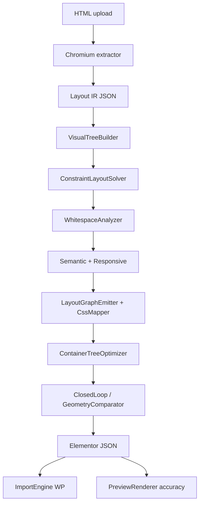

# Rendering Pipeline Forensic Audit

**Date:** 2026-07-16  
**Branch foundation:** `main` (post PR #12, ~84.1% suite composite)  
**Goal:** Identify where browser-calculated layout is lost before Elementor emission.

This is not an HTML-parser audit. It traces **Chromium layout truth → Elementor JSON**.

---

## 1. Current understanding

The product is a **Browser Rendering Compiler**:

```
HTML → Chromium paint/layout → Intermediate Representation (IR)
  → Visual tree / constraints / semantics
  → Elementor native JSON (+ custom CSS safety net)
  → Import / preview validation
```

Current suite score (~84%) is capped mainly by **information loss**, not missing widgets. The browser already computed correct widths, gaps, paint layers, and text metrics; later stages discard or approximate them.

---

## 2. Architecture

### Folder structure (plugin root)

| Path | Responsibility |
|------|----------------|
| `chromium-service/` | Headless Chromium extract (Node/Puppeteer) |
| `includes/Engine/` | Visual reconstruction, constraints, validation |
| `includes/Elementor/` | JSON emission, CSS mapping, optimizer |
| `includes/Services/` | ChromiumService, RenderResult |
| `includes/Export/` / `Import` path via Elementor ImportEngine | WP import |
| `tests/accuracy/` | 42-page real-world fidelity suite |
| `tests/benchmarks/` | Synthetic regression fixtures |

### Production execution flow

1. `ConversionPipeline::convert`
2. `ChromiumService::render` → `chromium-service/cli.js` → `extractor.js::renderToLayout`
3. `segmenter.js::browserPageSegmenter` (DOM + computed style + bbox IR)
4. Responsive re-measure (`measureUids`)
5. `ElementorJsonGenerator::generate` → `VisualReconstructionOrchestrator::prepare`
6. Pipeline engines (ordered below)
7. `LayoutTreeConverter` / `LayoutGraphEmitter` → Elementor tree
8. `ContainerTreeOptimizer`
9. `ClosedLoopValidationEngine` / `PixelRepairEngine`
10. Optional `ImportEngine::import`

### Prepare pipeline (v4)

```
VisualExtractionEngine
→ VisualTreeBuilder
→ LayoutGraphEngine
→ ConstraintLayoutSolver
→ SemanticComponentGraph
→ WhitespaceAnalyzer
→ AlignmentEngine
→ WrapperEliminationEngine
→ ResponsiveLayoutEngine
→ AnimationEngine          ← annotates IR only; never emitted
→ DesignTokenExtractor / MediaEngine / CssMappingEngine
```

---

## 3. Stage-by-stage: input, output, loss

### 3.1 Chromium extractor (`lib/extractor.js`, `lib/segmenter.js`)

| | |
|--|--|
| **Input** | HTML file |
| **Output** | `layout.json`: sections, trees, screenshots, assets, breakpoints |

**Transforms:** expand FAQ details; segment page; capture `styleSet`; responsive uid maps; screenshots.

**Information lost (earliest):**

| Loss | Location | Why it matters |
|------|----------|----------------|
| `display:none` / zero-size nodes dropped | `isVisible` / `buildTree` | Accordion/hidden content absent |
| Atomic tags (`h*`,`p`,`button`,`form`,…) do not recurse children | `ATOMIC` set | Nested icons/spans lost as structure |
| Depth/node caps | `MAX_DEPTH` / `MAX_NODES` | Large pages truncated |
| Section `CAPTURED_PROPS` thinner than node `styleSet` | section loop | Section-level style incomplete |
| Responsive `measureUids` omits color/bg/border/fw/lh | `measureUids` | Mobile paint/type drift |
| `::before`/`::after` stored in `pseudo` only | `pseudoStyle` | Never become Elementor nodes |
| Hover/focus states false at capture | `states` | Interactive styles missing |
| No `float`, multi-bg layers, `outline`, table layout | `styleSet` gaps | Entire layout families invisible |

### 3.2 VisualTreeBuilder

| | |
|--|--|
| **Input** | Chromium sections |
| **Output** | Possibly merged visual sections; restructured trees |

**Loss:** pass-through promotion drops wrappers; sibling regrouping can disagree with authored flex/grid; landmark merge guard (post-PR#12) prevents nav/hero collapse.

### 3.3 ConstraintLayoutSolver

| | |
|--|--|
| **Input** | Visual trees |
| **Output** | `layoutConstraint`, optional `s.gap`, stripped child margins |

**Critical loss:** `strip_child_margins` permanently deletes `mt/mb/ml/mr` when gap is collapsed. Vertical stacks often clear gap (`gap_from_margins`) but WhitespaceAnalyzer may still invent gap later.

### 3.4 WhitespaceAnalyzer

| | |
|--|--|
| **Input** | Constrained trees |
| **Output** | `whitespace`, may set `s.gap`, **clears child margins again** |

**Critical loss:** second irreversible margin wipe (`clear_child_margins`) even when gap was invented from margin geometry — earliest cause of spacing + height cascade failures.

### 3.5 SemanticComponentGraph + LayeredLayoutSolver

| | |
|--|--|
| **Input** | Trees + geometry |
| **Output** | `layoutRole`, `layeredLayout` → absolute content as flex stack |

**Loss:** absolute insets of content layers not preserved as Elementor positioned children; paint layers partially mapped to bg/overlay/custom CSS.

### 3.6 LayoutGraphEmitter / LayoutTreeConverter / CssMapper

| | |
|--|--|
| **Input** | Solved IR |
| **Output** | Elementor `_elementor_data` |

**Loss:**

- Transparent container hoist drops intermediate boxes with spacing
- Pure composite patterns replace subtrees (FAQ/form/testimonial)
- Container **margins never mapped** (`CssMappingEngine::map_container`)
- Grid → flex + custom CSS; flex item `fg/fsh/fb/ord` unused
- `minW/maxW/maxH` not mapped (`CssMapper::sizing` ≈ `minH` + opacity)
- Paint effects → `_h2e_custom_css` only (OK if imported; missing in accuracy preview)
- `motionEffects` never emitted (AnimationEngine dead end)
- Typography `whiteSpace` / `wordBreak` unmapped

### 3.7 ContainerTreeOptimizer

Merges/splits containers. Can remove wrappers that still carried layout identity.

### 3.8 Validation / Preview oracle

`ElementorPreviewRenderer` approximates Elementor; accuracy suite (`compile-and-preview.php`) does **not** inject `assets.combinedCss` or collect `_h2e_custom_css` → pixel scores understate real import fidelity and mis-rank paint issues.

### 3.9 ImportEngine

Survives: Elementor controls + scoped `_h2e_custom_css` + optional full source CSS.  
Does not make custom CSS editable as native controls. Suite never runs import.

---

## 4. Data flow diagram



---

## 5. Top accuracy blockers (ranked)

| Rank | Blocker | Earliest stage | Expected suite gain |
|------|---------|----------------|---------------------|
| 1 | Margin→gap wipe destroys per-child spacing → wrong wrap/height | ConstraintSolver + WhitespaceAnalyzer | +1.5–3% |
| 2 | Preview oracle omits source/custom CSS + weak composite HTML | compile-and-preview / PreviewRenderer | +1–2% (pixel metric honesty + paint) |
| 3 | Container max-width / fixed width / flex-item props unmapped | CssMapper::sizing / flex | +1–2% |
| 4 | Emitter hoist / missing frames | LayoutGraphEmitter | +1–2% |
| 5 | Grid approximated as wrapping flex | CssMapper::flex | +0.5–1.5% |
| 6 | Absolute layer insets flattened | LayeredLayoutSolver | +0.5–1.5% |
| 7 | Atomic truncation in segmenter | segmenter.js | +0.5–1% |
| 8 | Thin responsive mapping | measureUids → ResponsiveLayoutEngine | +0.5–1% |
| 9 | Typography white-space / word-break | CssMapper::typography | +0.3–0.8% |
| 10 | Pseudo-elements never emitted | segmenter → emission gap | +0.3–0.8% |

---

## 6. Files primarily affected by fixes

- `chromium-service/lib/segmenter.js`
- `includes/Engine/ConstraintLayoutSolver.php`
- `includes/Engine/WhitespaceAnalyzer.php`
- `includes/Engine/CssMappingEngine.php`
- `includes/Elementor/CssMapper.php`
- `includes/Elementor/LayoutGraphEmitter.php`
- `includes/Engine/LayeredLayoutSolver.php`
- `includes/Engine/ElementorPreviewRenderer.php`
- `tests/accuracy/compile-and-preview.php`
- `tests/accuracy/run-suite.js`

---

## 7. Implementation order (earliest loss first)

1. Stop irreversible margin clearing unless CSS `gap` existed  
2. Map container width/max-width/margins + flex-item props  
3. Wire preview + debug artifacts to include paint CSS  
4. Preserve containers that carry spacing/width  
5. Improve grid track → % columns / custom CSS consistency  
6. Absolute children with real insets  
7. Segmenter atomic recursion for mixed leaves  
8. Expand corpus + multi-metric reports  

**Target path:** 84% → 90%+ via layout/spacing preservation; 95% needs paint + absolute + responsive completeness.
